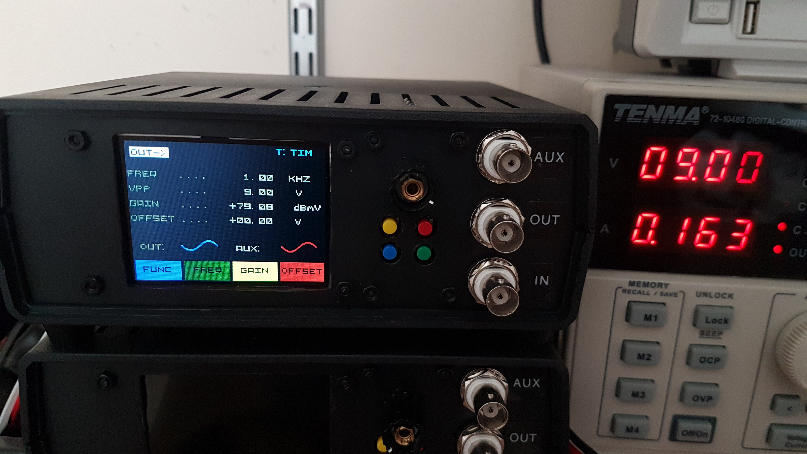
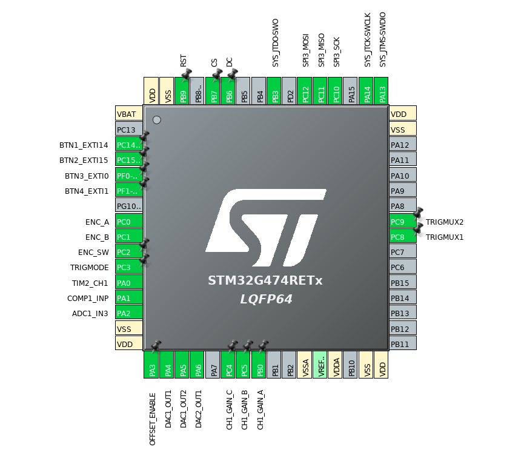
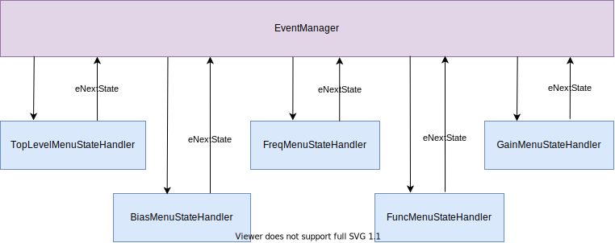
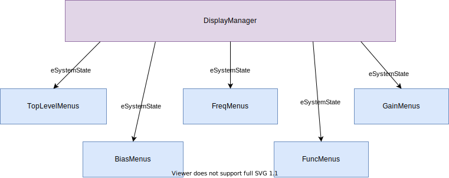
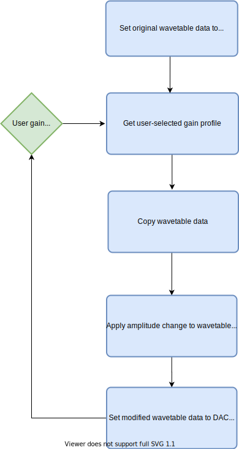
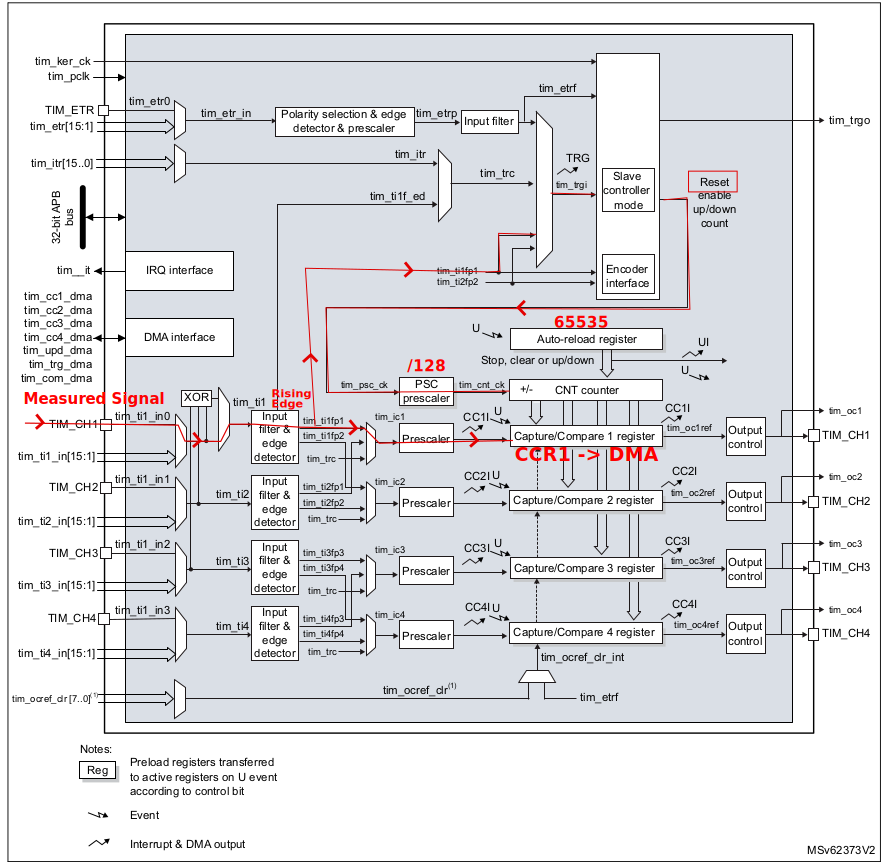

# Function Generator
<P>
<center>

</center>
</P>

This STM32-based instrument has the following features:

- Output signal with synchronized auxiliary output for re-triggering.
- Input signal trigger using frequency or voltage.
- User-modifiable output attributes including function, frequency, gain and DC offset.
- Frequency Sweep mode.
- RGB colour TFT LCD display.
- Small form factor.

### Specification

|Attribute|Limits|
|---------|------|
Power Supply|9 Volts<br>163 mA DC<br>Center-positive 2.1mm barrel jack<br>Reverse-polarity protected
Input/Output connectors|BNC<br>400W TVS protection
Function| Sine<br>Square<br>Ramp<br>Reverse Ramp<br>Triangle<br>Pulse<br>PWM (aux output only)
Frequency|0.1Hz - 100KHz
Gain|40 dbmV - 79.8 dbmV<BR>0.1 Vpp - 9 Vpp
DC offset|+/- 9V
Output Noise (100KHz)| -76  db (10KΩ)<br>-60 db (500Ω)<br>11 nV/√Hz
Output Current|10 mA nominal<br>20 mA peak
Sweep|12.5 sec per step (max)<br>0.59 nanosec per step (min)
Input trigger range| See "Voltage Measurements" section
Dimensions|Height:&nbsp;70mm<br>Width:&nbsp;170mm<br>Depth:&nbsp;170mm

### STM32G474RE Pin Assignment

Full STM32Cube report be found [here](readme_diagrams/FunctionGeneratorCortexM4_SW_V1.pdf).
<P>
<center>

</center>
</P>

### Timer Functions

Timer | Function | Notes
--- | -------- |-----
TIM1  | Rotary Encoder | Encoder Mode TI2
TIM2  | Input Trigger | Input Capture Direct Mode (see Input Trigger section). Preload Enabled
TIM3  | PWM function | AUX output only
TIM5  | Frequency Sweep | Both outputs (32bit timer)
TIM8  | DAC Trigger | Update Event. Preload Enabled
TIM15 | Display Manager | Calls DM_UpdateDisplay()
TIM16 | Button debounce
TIM17 | Event Manager | Called EM_ProcessEvent()

### Graphics Library

This project contains a modified and optimised version of the [STM32-ILI9341](https://github.com/martnak/STM32-ILI9341) library.


- Optimized to use direct-to-register SPI for single- and multi-byte transfers (MOSI only). This offers a noticeable performance boost over HAL API.
- Draw functions were modified to use x,y,width,height parameters.
- Additional draw functions from STMBasicGUI were included.


### Event Manager

EventManager.h defines system states and events for the menu display and user controls (buttons and rotary encoder).


  eSystemState |
  ------|
  Toplevel_Main_Menu_State
  Toplevel_Output_Menu_State
  Toplevel_Input_Menu_State
  Func_Main_Menu_State
  Func_Signal_Menu_State
  Func_Aux_Menu_State
  Gain_Main_Menu_State
  Gain_Signal_Menu_State
  Gain_Aux_Menu_State
  Freq_Main_Menu_State
  Freq_Preset_Menu_State
  Freq_Adjust_Menu_State
  Freq_Sweep_Menu_State
  Freq_Prescaler_Menu_State
  Bias_Menu_State
  Idle_State = Toplevel_Main_Menu_State

eSystemEvent|
-----|
evIdle,						
evBlueBtn,				
evGreenBtn,				
evYellowBtn,			
evRedBtn,				
evEncoderSet,			
evEncoderPush,			
evSweepEnableBtn,
evSweepModeBtn,			
evSweepSpeedBtn,
evSweepLimitBtn,


Active event and state are held in global variables eNextState and eNewEvent, respectively.

Interrupts triggered by the buttons and rotary encoder are processed by InterruptManager.c, which sets the global event variable to the appropriate event.

The EM_ProcessEvent function is periodically called by Timer #17.

EM_ProcessEvent selects the *current* state and calls the related event handler for the *new* event. A simplified version is shown below:

```
void EM_ProcessEvent()
{

    switch(eNextState)
	{
        case someState1:

            if(eNewEvent == evSomeEvent1)
                eNextState = doSomeEventHandler1();
            break;

            if(eNewEvent == evSomeEventN)
                eNextState = doSomeEventHandlerN();
            break;

        case someStateN:
        ....
    }

}
```

The Event handler for the new event is called and *returns the next system state.*

Business logic for Top level menu, Function menu, Frequency menu, Gain menu and Offset Bias menu are delegated to separate files.

<center></center>


### Display Manager

DisplayManager.h defines a standard colour palette used by the graphics library.

The ILI9341 LCD driver IC  has a very low refresh rate. To avoid flicker, the background is redrawn only on eSystemState change (when the user navigates to a different menu screen). All text is periodically redrawn by Timer15, which executes DM_UpdateDisplay() function. To avoid flicker, text strings must be positioned so that they do not overlap.

The DisplayManager queries the active system state and determines which menu is to be enabled. The business logic of drawing the menus is delegated to seperate files. The system state variable is passed to the file for further sub-menu delegation.

<center></center>

### Output signal

The output function of the device is generated through a series of wavetables.
These wavetables are generated using python scripts into C source files.
The python scripts and wavetable source files can be found in the WaveTableGeneration directory.

The wavetables are generated at 120 samples per second and offset above the zero point.
The wavetable data is loaded into DAC1 Channel 1 via DMA, which is triggered via Timer 8. This timer must have its auto-reload preload enabled so that the DMA peripheral is not interruped mid-cycle. Interrupting the DMA peripherla mid-cycle can cause the DAC output to randomly fail.

DC voltage is output from DAC1 Channel 2.  This offset is (optionally) inverted and mixed with the output signal from DAC1 Channel 1 to provide DC offset at the device output.

A PGA was included in the HW design to provide gain at the device output. However, the settling time of the PGA was insufficient, which caused significant "jitter". Therefore, the PGA is left at maximum gain, whilst realtime gain adjustments are achieved in SW by modifying the amplitude of the wavetable data.

<p>
<center>

</center>
</p>

An auxiliary output is also provided on pin PA6 using DAC2 Channel1. This aux output uses the same trigger timer (TIM8) as DAC1 and so is syncronized with the main output signal.
The auxiliary output provides same signal functions plus a pulse width modulated function. This is achieved by disabling the DAC2 Channel1 output and redirecting the Output Compare register of TIM3 on pin PA6.

The output frequency of all outputs are adjusted simulataneously by modifying the reload register of the trigger timer (TIM8).

A frequency sweep feature is also implemented.

### Input Trigger

Input trigger function including external multiplexing, DMA callbacks, frequency and voltage measurements are handled by InputTrigger.c

#### External Multiplexer

An external "TS5A3357" SP3T switch [(datasheet)](http://www.ti.com/lit/ds/symlink/ts5a3357.pdf) selects the input signal path into the microcontroller.

IN1     | IN2     | FUNCTION
:------:|:-------:|:--------:
H       | L       | TIM2 (PA0)
L       | H       | COMP (PA1)
H       | H       | ADC  (PA2)

TS5A3357 pins IN1 and IN2 are set/reset by microcontroller pins PC8 and PC9, respectively.


#### Frequency Measurement

In "Time Mode" the input signal frequency is measured using reciprocal counting methods with TIM2.

- When this mode is enabled TIM2 is enabled and begins counting to 0xFFFF.
- The input signal is externally multiplexed into port PA0 (set to alt. function TIM2_CH1).
- This is internally multiplexed using the interconnect to "tim_ti1_in0".
- A rising edge detected on the input signal triggers a "tim_ti1_fp1" signal to Input Capture Channel 1 and the slave controller.
- TIM2 is configured to reset its count on "tim_ti1_fp1" trigger signal. This sends an write request to the DMA controller and contents of CCR1 is written to memory.

<p>
<center>

</center>
</p>

- On timer capture callback, the frequency in hertz is then calculated:

      Freq = MCLK / (TIM2->PSC * TIM2->CCR1)

- Longer processing delays for input frequencies lower than 50Hz are expected.
- At these lower frequencies the input trigger automatically enters "LF Mode" and adjusts the prescaler to improve resolution/accuracy.

#### Voltage Measurements

The ADC measures the voltage level of the input signal and compares it - within the nearest 0.05V - to the values in the following lookup table:

note|volts|hertz|period
----|-----|-----|------
C0|0.08|16.35|42813
C#0|0.17|17.32|40416
D0|0.25|18.35|38147
D#0|0.33|19.45|35990
E0|0.42|20.60|33981
F0|0.50|21.83|32066
F#0|0.58|23.12|30277
G0|0.67|24.50|28571
G#0|0.75|25.96|26965
A0|0.83|27.50|25455
A#0|0.92|29.14|24022
B0|1.00|30.87|22676
C1|1.08|32.70|21407
C#1|1.17|34.65|20202
D1|1.25|36.71|19068
D#1|1.33|38.89|17999
E1|1.42|41.20|16990
F1|1.50|43.65|16037
F#1|1.58|46.25|15135
G1|1.67|49.00|14286
G#1|1.75|51.91|13485
A1|1.83|55.00|12727
A#1|1.92|58.27|12013
B1|2.00|61.74|11338
C2|2.08|65.41|10702
C#2|2.17|69.30|10101
D2|2.25|73.42|9534
D#2|2.33|77.78|9000
E2|2.42|82.41|8494
F2|2.50|87.31|8017
F#2|2.58|92.50|7568
G2|2.67|98.00|7143
G#2|2.75|103.83|6742
A2|2.83|110.00|6364
A#2|2.92|116.54|6007
B2|3.00|123.47|5669
C3|3.08|130.81|5351
C#3|3.17|138.59|5051
D3|3.25|146.83|4767
D#3|3.33|155.56|4500
